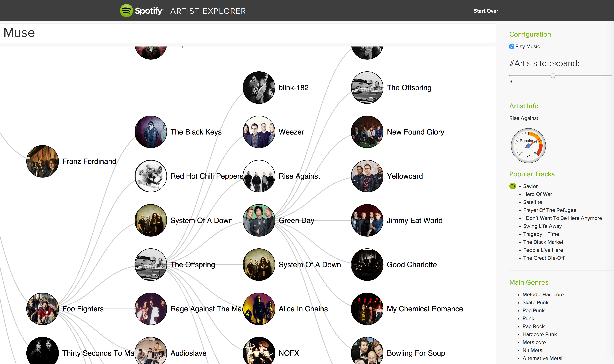

Artist Explorer
===============

See Artist Explorer at [artistexplorer.spotify.com](https://artistexplorer.spotify.com/)

Artists Explorer is a tool that helps serious music enthusiasts explore artist relationships and discover new music. Start from any artist and quickly navigate through trees of related artists, previewing their music as you go.

The app pulls related artist information from Spotify Web APIs. Have a look at the documentation at:

* [https://developer.spotify.com/web-api/](https://developer.spotify.com/web-api/)

Running Locally
===============
**Not necessary but strongly suggested:** Create a [virtualenv] (http://docs.python-guide.org/en/latest/dev/virtualenvs/) or use an existing one before installing dependencies of this project.


Echo Nest API calls are proxied through a flask server. You need to start the server first.

```
cd server
pip install -r requirements.txt
python server.py
```

And you also need to serve the files at the root of the project. You can use SimpleHTTPServer module in python. To do that, change directyory to the project base and enter the following command:
```
python -m SimpleHTTPServer
```

App
===


Consumed Libraries:
--------------
* [d3](http://d3js.org/)
* [Google Gauge Charts](https://developers.google.com/chart/interactive/docs/gallery/gauge)
* [Spotify Web API Wrapper](https://github.com/JMPerez/spotify-web-api-js)
* [geoplugin](http://www.geoplugin.com/)
* [freegeoip](https://freegeoip.net)

